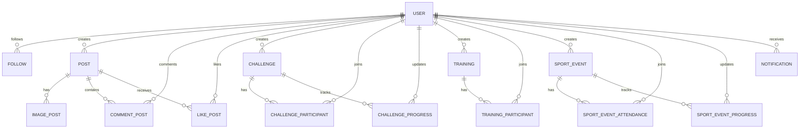

# ERD Cot Loi (Social + Fitness + Moderation)

Tai lieu nay mo ta ERD muc logic nghiep vu de trinh bay trong bao ve. Day khong phai danh sach day du 100% schema, ma la "core model" de hoi dong hieu nhanh.

## 1) Nhom thuc the chinh

- **User**: thong tin tai khoan, role, profile.
- **Follow**: quan he theo doi giua 2 user.
- **Post** + **CommentPost** + **LikePost** + **ImagePost**: tuong tac xa hoi.
- **Challenge** + **ChallengeParticipant** + **ChallengeProgress**: thach dau cong dong.
- **Training** + **TrainingParticipant**: hoat dong huan luyen.
- **SportEvent** + **SportEventAttendance** + **SportEventProgress**: su kien the thao.
- **Notification**: thong bao he thong/realtime.
- **Report (concept)**: du lieu bao cao vi pham (post/challenge/sport-event) phuc vu inspector moderation.

## 2) ERD tong quan (Mermaid)

## 3) Luat nghiep vu quan trong

- Mot user co the tao nhieu post/challenge/training/sport event.
- Mot post co nhieu comment/like/image.
- Mot user co the tham gia nhieu challenge/training/event, quan he qua bang participant/attendance.
- Notification gan voi user nhan va duoc cap nhat trang thai da doc/chua doc.
- Moderation flow thao tac tren cac doi tuong da bi report (an/noi dung bi xoa tam/restore).

## 4) Goi y trinh bay khi bao ve

- Nhom bang theo "bounded context": Social, Fitness Activity, Moderation.
- Neu hoi dong hoi chi tiet, mo rong bang schema that trong `DATN_BE/src/models/schemas`.
- Nhan manh rang model da su dung theo huong event/community thay vi app don le mot nguoi.
