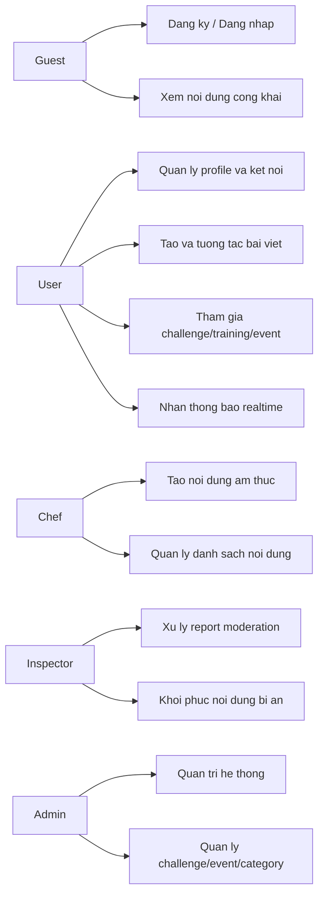

# Use-Case Chinh Theo Vai Tro

## 1) Actors

- **Guest**: khach chua dang nhap.
- **User**: nguoi dung thong thuong.
- **Chef**: user role dac thu cho noi dung am thuc.
- **Admin**: quan tri he thong.
- **Inspector**: kiem duyet noi dung va bao cao vi pham.

## 2) Use-case cho Guest

1. Xem noi dung cong khai (explore/public feed).
2. Dang ky tai khoan.
3. Dang nhap he thong.

## 3) Use-case cho User

1. Quan ly profile, theo doi nguoi dung khac (follow/friends).
2. Dang bai viet, like/comment/share, bao cao noi dung.
3. Tao/tham gia challenge, cap nhat tien do, xem bang xep hang.
4. Tao/tham gia training, xem leaderboard.
5. Tao/tham gia sport event, theo doi progress.
6. Nhan va doc thong bao.

## 4) Use-case cho Chef

1. Tao/chinh sua recipe, blog, album.
2. Quan ly danh sach noi dung da tao.
3. Gui noi dung cho inspector review (theo flow moderation).

## 5) Use-case cho Admin

1. Dang nhap trang tri.
2. Quan ly danh muc the thao, su kien, challenge.
3. Quan ly user, role va thong ke tong quan.
4. Phoi hop inspector xu ly vi pham.

## 6) Use-case cho Inspector

1. Xem danh sach report (post/challenge/sport-event/...).
2. Duyet hoac tu choi report.
3. Xem noi dung da xoa tam va khoi phuc.
4. Kiem duyet noi dung chef/blog/recipe/album.

## 7) So do use-case tong quan (Mermaid)

## 8) Tieu chi nghiem thu de bao ve

- Moi actor chinh co it nhat 1 luong thao tac thanh cong.
- Luong moderation co bang chung "report -> duyet/reject -> anh huong UI".
- Luong social co bang chung realtime notification (socket event).
